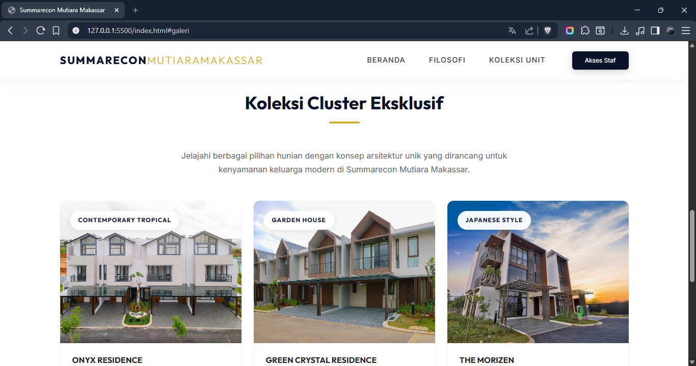
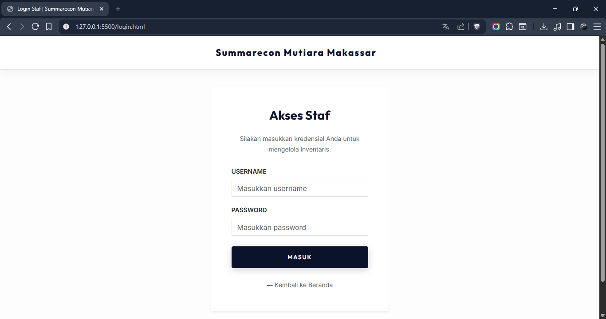
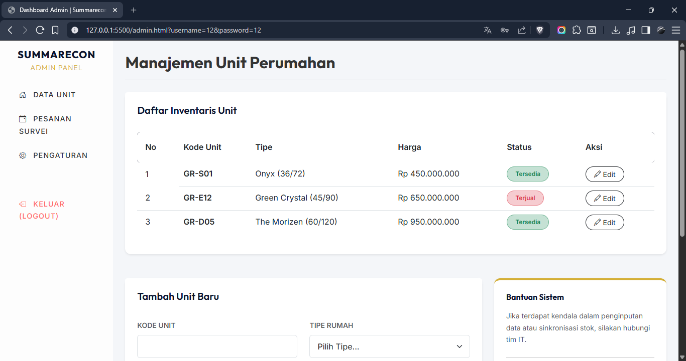

# UTS Pemrograman Web - Website Perumahan "Summarecon Mutiara Makassar"

Proyek ini adalah implementasi template website profil perumahan yang dirancang untuk memenuhi kriteria tugas UTS Pemrograman Web. Website ini berfokus pada estetika minimalis, elegan, dan profesional tanpa menggunakan JavaScript.

## Fitur Utama

1.  **Landing Page (`index.html`):** Informasi publik mengenai unit rumah, deskripsi proyek, dan galeri visual.
2.  **Halaman Login (`login.html`):** Antarmuka otentikasi untuk staf administrasi.
3.  **Halaman Dashboard Admin (`admin.html`):** Manajemen inventaris unit perumahan menggunakan tabel data dan formulir input.

## Tampilan Website

### Landing Page - Beranda


### Landing Page - Filosofi


### Landing Page - Koleksi Unit



### Halaman Login



### Halaman Dashboard Admin



## Arsitektur Kode: Bootstrap vs CSS Murni

Proyek ini menggabungkan penggunaan _framework_ Bootstrap 5 dan CSS murni untuk menciptakan desain yang premium dan efisien. Berikut adalah pembagian peran dari masing-masing teknologi:

### Menggunakan Bootstrap 5 (_Utility Classes_)

Struktur dan tata letak dasar dikendalikan langsung melalui _class_ bawaan Bootstrap di dalam HTML.

- **Sistem Layout & Responsivitas:** Penggunaan `container`, `row`, `col-md-*`, dan _flexbox_ (`d-flex`, `justify-content-*`) untuk tata letak yang konsisten di berbagai perangkat.
- **Komponen Standar:**
  - **Cards:** Komponen galeri properti (menggunakan `.card`, `.card-body`, `.shadow-sm`, `.rounded-4`).
  - **Tabel & Form:** Desain daftar unit (`.table`, `.table-hover`) dan formulir input (`.form-control`, `.form-select`) di Dasbor Admin.
  - **Badge & Indikator:** Penanda status unit atau kategori desain (`.badge`, `.bg-success`, `.text-dark`, `.position-absolute`).
- **Utility Praktis:** Penggunaan spasi margin/padding (`m-3`, `p-4`), dan kontrol tipografi dasar (`fw-bold`, `text-muted`, `text-uppercase`).

### Menggunakan CSS Murni (`style.css`)

File CSS kustom dirancang sangat ringkas (sekitar 50 baris) dan secara eksklusif difokuskan pada identitas merek dan _micro-interactions_ estetis yang tidak tersedia di Bootstrap.

- **Tipografi & Palet Warna Global:** Penerapan _Google Fonts_ (Outfit & Inter) serta penentuan variabel warna premium (_Midnight Blue_, _Gold_) melalui `:root`.
- **Efek Transisi & Animasi (Hover):**
  - Pembuatan class `.card-hover` untuk memberikan efek melayang (`translateY`) dan pembesaran gambar (`scale`) yang elegan saat kartu disorot oleh _mouse_.
  - Transisi warna yang mulus untuk tautan navigasi dan kotak fitur.
- **Komponen Visual Khusus:**
  - Gaya tombol kustom eksklusif seperti `.btn-minimal` dan `.btn-dark-minimal`.
  - Lapisan gradasi (_linear-gradient overlay_) khusus pada latar belakang gambar _Hero Section_.
  - Elemen dekoratif geometris seperti garis bawah kustom pada judul bagian (`.section-title::after`).

## Struktur Folder

```text
uts-pemrograman-web/
├── css/
│   └── style.css      # Custom styling & overrides
├── img/               # Folder untuk aset gambar konten
├── public/            # Folder untuk tangkapan layar (screenshot) website
├── admin.html         # Halaman Dashboard Admin
├── index.html         # Halaman Utama / Landing Page
├── login.html         # Halaman Login Staf
└── README.md          # Dokumentasi proyek
```

## Cara Penggunaan

Cukup buka file `index.html` di browser pilihan Anda. Navigasi tersedia di bagian atas untuk berpindah antar bagian halaman atau menuju halaman login staf. Proyek ini murni menggunakan HTML dan CSS (termasuk _Bootstrap_ versi CSS).
